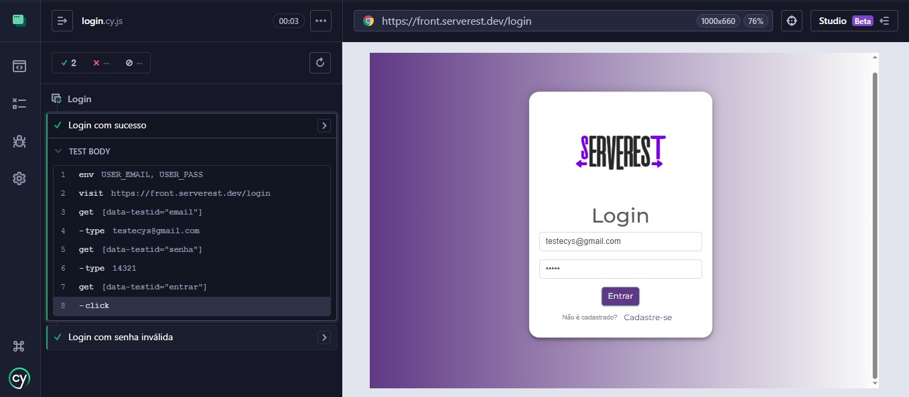
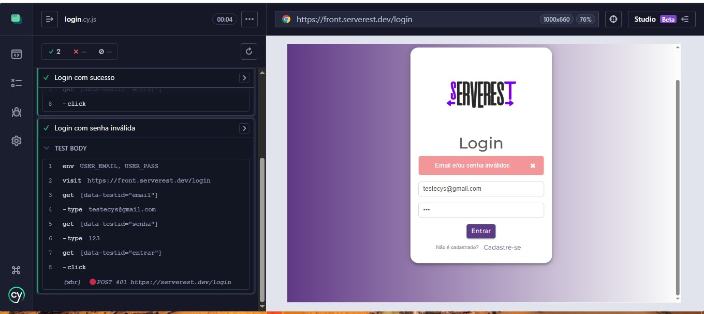
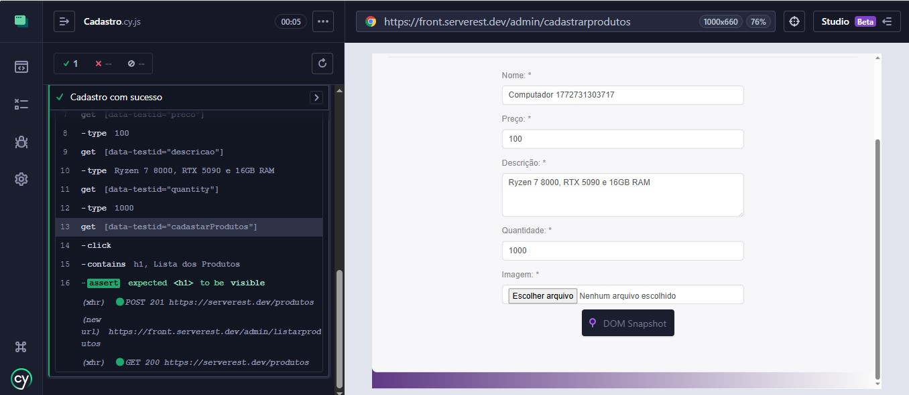
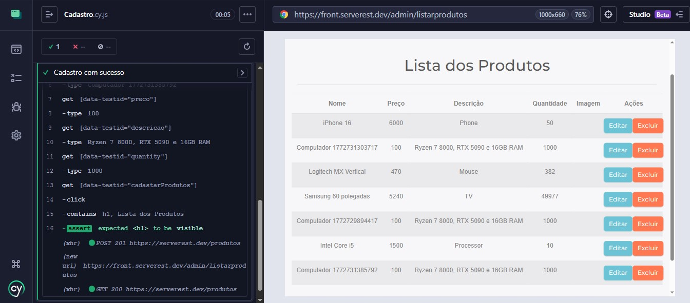

# QA Automation Cypress

Projeto de automação de testes end-to-end utilizando **Cypress** para validar funcionalidades de uma aplicação web.

O objetivo deste projeto é demonstrar conhecimentos básicos de **QA Automation**, incluindo organização de testes, comandos customizados e uso de variáveis de ambiente.

---

## Tecnologias utilizadas

- Cypress
- JavaScript
- Node.js
- Git
- GitHub

---

## Estrutura do projeto

```
cypress
├─ e2e
│  ├─ login.cy.js
│  └─ Cadastro.cy.js
│
├─ fixtures
│  └─ example.json
│
└─ support
   ├─ commands.js
   └─ e2e.js

cypress.config.js
package.json
```

---

## Cenários automatizados

### Login
- Login com sucesso
- Login com senha inválida

### Cadastro de produto
- Cadastro de produto com sucesso
- Validação da navegação após cadastro

---

## Evidências (screenshots)

### Login com sucesso


### Login com senha inválida


### Cadastro de produto


### Lista de produtos


---

## Como executar o projeto

### 1️⃣ Clonar o repositório

```bash
git clone https://github.com/Nixssss/qa-automation-cypress.git
```

### 2️⃣ Entrar na pasta do projeto

```bash
cd qa-automation-cypress
```

### 3️⃣ Instalar dependências

```bash
npm install
```

### 4️⃣ Executar os testes

Abrir interface do Cypress:

```bash
npx cypress open
```

Executar testes em modo headless:

```bash
npx cypress run
```

---

## Variáveis de ambiente

Crie um arquivo chamado:

```
cypress.env.json
```

Exemplo:

```json
{
  "USER_EMAIL": "seu_email@email.com",
  "USER_PASS": "sua_senha"
}
```

Esse arquivo está incluído no `.gitignore` para evitar exposição de credenciais.

---

## Aplicação utilizada nos testes

Os testes utilizam a aplicação de demonstração:

https://front.serverest.dev

---

## Objetivo do projeto

Este projeto foi desenvolvido para praticar:

- automação de testes E2E
- uso do Cypress
- criação de comandos customizados
- organização de testes automatizados
- uso de variáveis de ambiente
- versionamento com Git e GitHub

---

## Autor

Murilo Ferreira  

Projeto de estudo em **Quality Assurance / Test Automation**